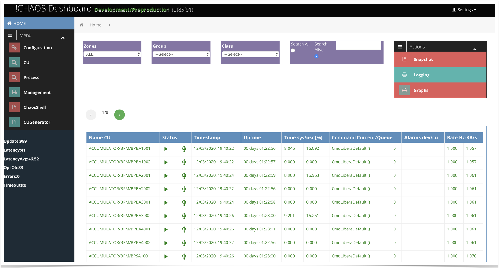
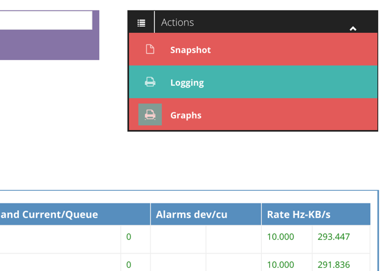
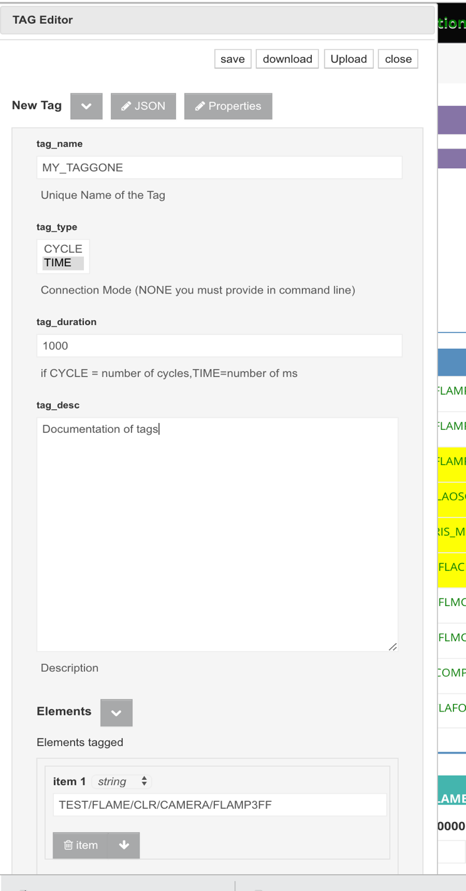
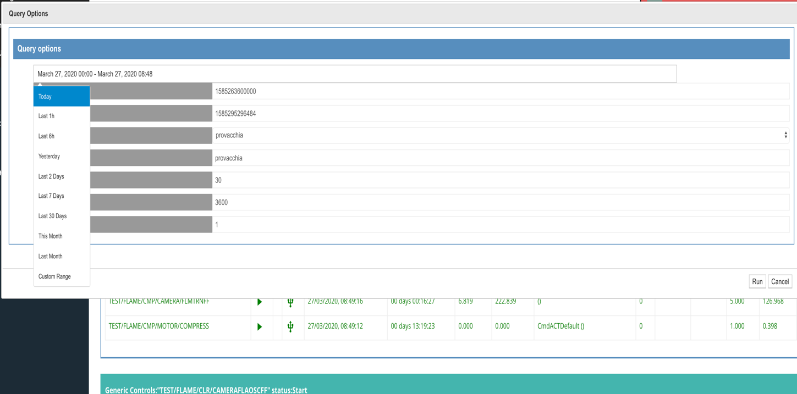
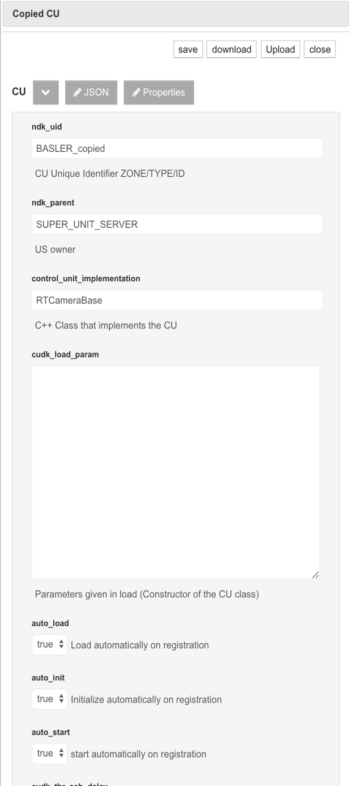
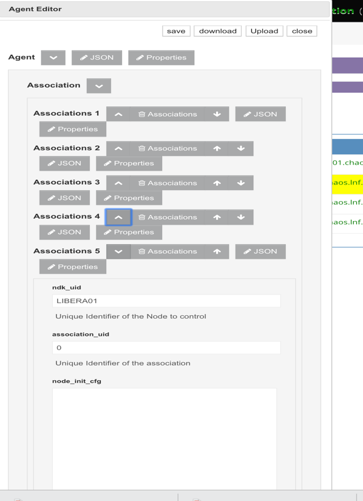
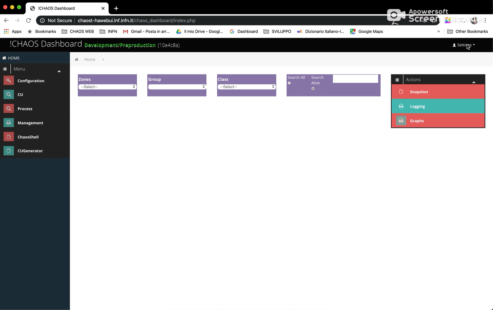

  Andrea Michelotti Page 1 4/2/20   
  --------------------------------- --
                                    
                                    
                                    
                                    
                                    

Table of Contents {#table-of-contents .TOC-Heading}
=================

[Getting Started 2](#getting-started)

[CU View 3](#cu-view)

[CU Context Menu 5](#cu-context-menu)

[Show/Set/Plot 7](#showsetplot)

[Tagging 11](#tagging)

[Show Tag Info 12](#show-tag-info)

[Retrive Zip History 13](#retrive-zip-history)

[Show description 14](#show-description)

[Take Snapshot 15](#take-snapshot)

[Management View 17](#management-view)

[Create an US 18](#create-an-us)

[Adding CU 19](#adding-cu)

[Copy/Move CU 20](#copymove-cu)

[US lifecycle 21](#us-lifecycle)

[US associated to agent 21](#us-associated-to-agent)

[US manually launched 22](#us-manually-launched)

[Associate a US to an Agent 22](#associate-a-us-to-an-agent)

[Dashboard Settings 25](#process-view)

[Configuration 25](#configuration)

[About 26](#about)

[Video Tutorials 27](#video-tutorials)

[Dashboard settings 27](#dashboard-settings-1)

Getting Started
===============

A web !CHAOS dashboard is associated to an installation of !CHAOS, at
the moment there are two installations:

1 -- preproduction, used mainly for testing of things that are going to
production <http://chaost-hawebui.lnf.infn.it/>

2 -- production used in production <http://chaos-hawebui.lnf.infn.it/>

i

CU View
=======

From this view its' possible to monitor and control CU in a generic way.
The dashboard shows by default this view. On start the view is empty,
the user has to make its own selection through the *Zone*, *Group* or
*Custom search*. The information of the CU is given in a table view. The
columns are self-explanatory.

In the bottom of the CU view a generic control of the selected CU is
shown (Figure 2 Monitor & Control).

{width="8.364583333333334in"
height="6.202029746281715in"}

Figure 1 Dashboard (CU view)

The CU view has two parts:

1.  Monitor table

2.  Generic control panel

In the monitor table the selected CU are shown with some parameter that
is shown, has for instance its state and uptime.

In the control panel its possible to give commands to one or more CU
that are selected.

**NOTE**: The ***Available commands*** is dynamically reconfigured in
base to the last CU selected.

{width="6.649305555555555in"
height="5.550694444444445in"}

Figure 2 Monitor & Control

CU Context Menu
---------------

In addition to the explicit generic control panel, a **context menu** is
available once a CU is selected (yellow) shown in Figure 5 CU context
menu. In order to access to the context menu, you should select a CU by
clicking the mouse and then push the right button of the mouse.

{width="6.5in"
height="2.0006944444444446in"}

Figure 3 CU context menu

The context menu allows easily to change status of one or more CUs (the
same operation can be done by the generic control panel), here below a
schema of the possible CU states:

{width="6.375in"
height="4.024219160104987in"}

Figure 4 CU states and transitions

The status of a CU is reported in the *Status* column of the table view.

A CU can be in different states:

-   NOT LOADED

-   LOADED

-   INITIALIZED

-   RUNNING

-   STOPPED

-   NOT INITIALIZED

The diagram shows the possible CU states (uppercase labels) and their
representative icons. The arrows indicate the commands

Without going into details, suffice to say that -- in order to be fully
operational -- a CU must stay in the RUNNING state.

When a US starts, it puts all its CUs in a predefined state, as from its
configuration data.

### Show/Set/Plot 

Through this item of the context menu is possible to visualize, set and
plot CU dataset items.

{width="6.5in"
height="4.3694444444444445in"}

Figure 5 Setting an input attribute

##### Set Attribute

In the figure above is shown how to set the *speed* input attribute of
the selected CU.

Set attribute actions:

1.  Select CU, RIGHT CLICK

2.  Select *Show/Set/Plot*

3.  Open *input* dataset

4.  Go on *speed,* LEFT CLICK,

5.  Write in the textbox the desired value

6.  ENTER

**NOTE:** Just attributes belonging to *input* dataset can be set.

**\
**

##### Plot *attribute*

The sequence to select the attribute is the same of Set Attribute, but
instead of LEFT CLICK on the attribute, do RIGHT CLICK to open the plot
menu.

Plot attribute actions:

1.  Select CU, RIGHT CLICK

2.  Select *Show/Set/Plot*

3.  Open *output* dataset

4.  Go on *speed,* RIGHT CLICK,

5.  On the plot menu select the plot type

ENTER

{width="6.5in"
height="4.3694444444444445in"}

Figure 6 Plotting an attribute

In this example we'll plot the *output* attribute *position* on Y.

Once selected a graph option dialog will open,

{width="3.8230774278215223in"
height="2.8215627734033246in"}

Figure 6 Graph options

We are going to setup the graph options of our new graph, here you can
select the size of the graph, the type.

Continuing the setup we have to add the attribute that we want to plot,
the attribute that we have selected is ready to be inserted by clicking
on the **Add Trace.**

{width="4.223077427821522in"
height="3.1167760279965004in"}

Figure 8 Trace add

**NOTE:** An attribute name is fully identified by concatenation of the
CU path and the attribute name:
*\<ZONEPATH\>/\<GROUP\>/\<CUNAME\>/\<dataset name\>/\<attribute name\>*

{width="6.5in"
height="4.4743055555555555in"}

**NOTE:** if the attribute is a vector it's possible to select a
particular component by adding \[\<*index*\>\], if *index=-1* all
component are selected

{width="2.8538462379702536in"
height="2.026963035870516in"}

To plot live or historical values, press **RUN.**

Saved graph can be recalled, from the *Graphs*

### Tagging

One or more CUs can be tagged for a given amount of time or for a number
of acquisition cycles. !CHAOS tag allows the dataset to be saved into a
permanent storage and identified with a given tag name.

Data that are tagged can be retrieved easily specifying the name of the
tag, and the system guaranties that those data are not swapped out by
ageing operations.

{width="3.3829833770778652in"
height="6.469231189851269in"}

{width="3.58794728783902in"
height="2.9769225721784776in"}

Figure 9 Tag command

Actions:

1.  Select the CU to tag

2.  CLICK RIGHT and select **Tag for..**

3.  In the tag editor specify **tag name**

4.  Choose between TIME or CYCLE

5.  Specify a duration

6.  An optional description

7.  SAVE

The tagging operation starts once the SAVE has been pressed.

In the *status* column will appear the icon of
{width="0.25in" height="0.25in"}

Figure 10 Tag editor

{width="6.5in"
height="1.7256944444444444in"}

Figure 11 Tagging in progress

### Show Tag Info

Through this option you can visualize information about the tags
associated to a particular CU.

{width="4.530768810148731in"
height="4.742300962379702in"}

Figure 12 Tag info dialog

### Retrive Zip History

Through this function is possible to retrieve data corresponding to a
particular tag and or time interval, of a given CU. By selecting this
option from the context menu a query dialog will open.

{width="2.7877635608048994in"
height="1.2461537620297463in"}

{width="6.591666666666667in"
height="3.261111111111111in"}

Figure 12 Query Dialog

The main parameters to set up the query are the epoch timestamps (GMT),
that specify the interval of time we are interested of; *a time picker
widget* can be used to facilitate the setup of the correct interval. The
time picker has predefined time interval (Last 1h, Last 6h...) and the
possibility to define a custom interval ranges.

The user can specify also a tag from a combo box, and some more
technical parameters that can speedup the search such as the page size
and the chunk time in seconds.

Once you've setup the parameters you can run the query, and the result
will be displayed in a graph or returned as a JSON zip.

##### Retrive ROOT Zip History

This is a experimental option that allows to download data in CERN ROOT
format, currently this option opens a Figure 12 Query Dialog, and launch
a !CHAOS process (see ) that in background retrieves the required data
that can be accessed just after this process ends.

### Show description

Through this option you can access to the full description of the
selected CU, it gives for instance a detail information of the dataset,
types, commands...

{width="4.030768810148731in"
height="4.367958223972003in"}

Figure 13 Description Dialog

### Take Snapshot

This function allows to save the setpoint of a selected group of CUs and
associate a name.

{width="6.5in"
height="2.4805555555555556in"}

Figure 15 Take Snapshot dialog

A previously saved snapshot can be restored, through the menu always
present in the top right of the web page.

{width="2.813953412073491in"
height="1.1537849956255468in"}

Figure 16 Access to the Snapshot Menu

The snapshot menu, will show the snapshots associated to the selected CU
or all the snapshots if no CU is selected.

{width="4.429957349081365in"
height="2.584615048118985in"}

Figure 17 Snapshot Menu

The snapshot menu shows the CUs that belongs to a given snapshot.

From this dialog is possible to:

**Show:** the dataset that is going to be restored,

**Apply**: the snapshot

**Delete:** the snapshot

**Upload:** a previously saved snapshot

**Save:** the snapshot locally on disk

Management View
===============

From this view it's possible to monitor, manage and control life cycle
of !CHAOS nodes.

All the operations can be performed just after having selected some
!CHAOS nodes, the two combo on top of the page allows to select the type
and the name of the !CHAOS node. The possible types are:\\

1.  **US** (Unit Server), that are container of CU (Control Units)

2.  **CU**(Control Unit), that are the node that abstract the control of
    some HW or virtual device.

3.  **Agent**, that are the CHAOS nodes that allows to launch US,
    ExecutionUnit processes

4.  **Webui**, that are the !CHAOS nodes that provide REST services
    (i.e. for the dashboards)

5.  **MDS**/CDS, that are the !CHAOS nodes that provide !CHAOS node
    management, Live and History services

Once a type is selected (2) it's possible to filter by name and by
activity (3) (just live nodes or all nodes), a list of nodes with some
other information should be displayed as a table.

By clicking RIGHT mouse on one or more node (4) it's possible to access
to the **context menu** that will show the possible operation on the
selected node (5).

Common operations are typically **Start**, **Stop** or **Kill**.

{width="6.326084864391951in"
height="3.03125in"}

Figure 18 Management View

In the following paragraphs will be described the most common
procedures.

Create an US
------------

WE remind that an UnitServer is a container of Control Units/Execution
Units. Create an US is essentially a creation of a container and a list
of CU that it manages.

To create an empty US we need just to RIGHT CLICK on the table and
choose **New US..**

{width="2.8012150043744533in"
height="2.7461537620297465in"}

Figure 19 New US

An **US Editor**, will be open,

{width="3.5076924759405075in"
height="3.117199256342957in"}

Figure 20 US Editor

We need to provide an **unique** name that will identify the newly
created US. At this point we can just **save generating an empty US, or
we can upload an US configuration previously written on disk. This is
the preferred way when you want to import a US from one infrastructure
(i.e. test) to another (i.e. production).**

### Adding CU

To fill an empty US we can proceed in 3 ways:

1.  Add a CU from an existing local configuration

2.  Add a CU from a template

3.  Copy/Move an existing CU into the new US

For the first two we just have to select the new US and use the
**context menu**.

{width="4.420158573928259in"
height="3.007691382327209in"}

Figure 21 Add a CU from menu

The third method, is strongly suggested if the device has similar
initializations, drivers; envision the use of the context menu specific
for the CU **Node Type**, that explicitly has a copy/move function.

### Copy/Move CU

To copy or move a CU to a specific US we should:

1.  Select **cu** in **Node Type**

2.  Select **Search All**

3.  Optional set the name or simply press **ENTER**

4.  Select the CU to move/copy

5.  {width="2.808333333333333in"
    height="6.276388888888889in"}RIGHT click -\> Copy CU

6.  Select **us** in **Node Type**

7.  Select the target US

8.  Paste/Move

9.  Choose if move or copy

{width="3.346153762029746in"
height="2.267590769903762in"}{width="2.193963254593176in"
height="1.0873873578302713in"}

After choosing the **CU Editor** will be open to modify name and
optionally any other parameter.

Figure 22 CU Editor

US lifecycle 
------------

We should distinguish between:

1.  US that are associated to a !CHAOS agents

2.  US that are not associated and are started manually.

In the first case, the life cycle and debug is simpler, because we can
handle full lifecycle from the dashboard through the agent (start, stop,
kill and console).

**NOTE**: the last column (*parent*) tells which is the agent node that
controls the US.

### US associated to agent

To start a US that is **not activ**e, we should:

10. Select **us** in **Node Type**

11. Select **Search All**

12. Optional set the name or simply press **ENTER**

13. Select the US

14. RIGHT click -\> Start US..

{width="6.5in"
height="3.3361111111111112in"}

Figure 19 Starting a US associated to Agent

Here in the figure above a we are going to start a US named
**FLAME\_TRL.**

To stop a US that is **activ**e, we should:

1.  Select **us** in **Node Type**

2.  Select **Search Alive**

3.  Optional set the name or simply press **ENTER**

4.  Select the US

5.  RIGHT click -\> Stop US.. or Kill Us.. or Shutdown

**NOTE:** Kill a US will kill all the CU the are contained as well

**NOTE:** Sometime the agent cannot kill in a ordered way the US, in
this case the **Shutdown** option must be selected, it performs a brute
force kill, that avoid also a clean response by the US, so the result of
the operations is often reported as *failed*, even if the kill operation
*succeed*.

**NOTE:** in rare cases (i.e. driver blocked in IO) even the
**shutdown** operation is not able to kill the process, in these cases
an intervention of the system administrator of the machine that runs the
US is required.

### US manually launched

In this case it's not possible to fully control the lifecycle, the
dashboard can just try to stop the **US** performing a **shutdown**
operation.

**NOTE:** these US don't have the *parent column* set.

### Associate a US to an Agent

The easiest way to create an association is:

1.  select the US to associate

2.  RIGHT click accetto to the context menu and choose **Copy**.

{width="2.8in"
height="2.7533344269466316in"}

Figure 20 Copying a US

3.  change **Node Type** to agent

4.  select the destination agent

5.  RIGHT click-\>Associate \<name of copied the US\>

{width="4.084027777777778in"
height="3.074802055993001in"}

{width="2.7215277777777778in"
height="3.745833333333333in"}Figure 21 Associate US

This point an **agent editor** will open, allowing to setup additional
parameters to the start of the associated US.

Figure 22 Agent Editor

Process View
============

This view is mainly used to lunch, monitor and manage CHAOS processes.
In the top of the page are shown an array of graphs that monitor the
load of the available !CHAOS nodes that can host the execution of a new
script, process or application. In the process table are also shown the
US that are launched and managed by !CHAOS agents.

{width="7.048845144356956in"
height="3.623076334208224in"}

Figure 27 Process Table

{width="2.264744094488189in"
height="1.835343394575678in"}By RIGHT clicking in the blu area (in the
red rectangle), you can access to the context menu for launching and
managing script.

By selecting a process you can access the context menu of the process.

ChaosShell View
===============

The chaos shell view offer the user the possibility to access !CHAOS
resources, through a web console, that accepts javascript. This web
console loads the *jchaos.js* library (the same used by the dashboard
itself), that allows to access !CHAOS resources.

The primary to use is to test and debug, or run control scripts on the
client side.

{width="7.385405730533683in"
height="3.6769225721784777in"}

From this view is also possible load and execute file from you local
disk.

**NOTE**: scripts may be also launched directly into infrastructure
through the Process View

Jchaos.js library

Configuration View
==================

Dashboard Settings
==================

Configuration
-------------

Through *Settings-\>Config* you can set some useful parameters like the
default refresh rate of the !CHAOS nodes or the elements shown per page.

{width="2.4156627296587927in"
height="2.4672430008748907in"}

By selecting *Config..* a editor will open showing the parameters that
can be edited.

{width="2.4155653980752407in"
height="3.253011811023622in"}

NOTE: these values will be saved into the cache of the browser so these
parameters will be permanent until a clear cache is performed.

About
-----

Through *Setting-\>About..* you can access to the info of the most
important !CHAOS services: *mds, webui, agent*.

For instantce a system administrator through this panel can check the
build information of the different services.

{width="4.088286307961504in"
height="4.0120472440944885in"}

{width="6.5in" height="4.093055555555556in"}Video Tutorials
=================================================================================================

Dashboard settings
------------------
