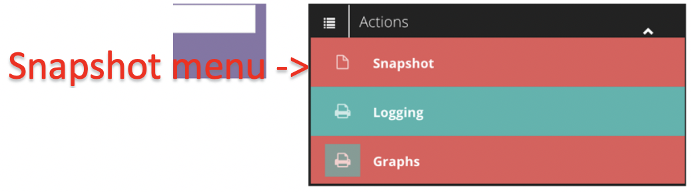
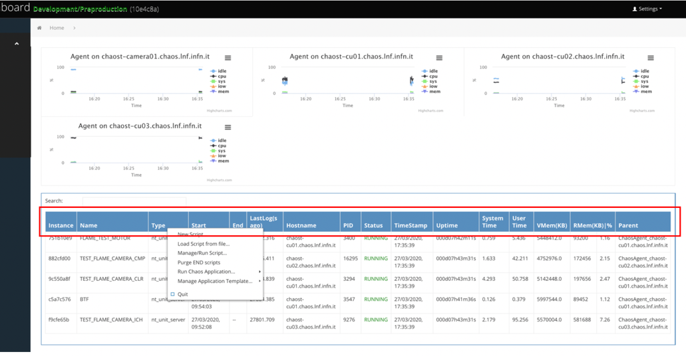
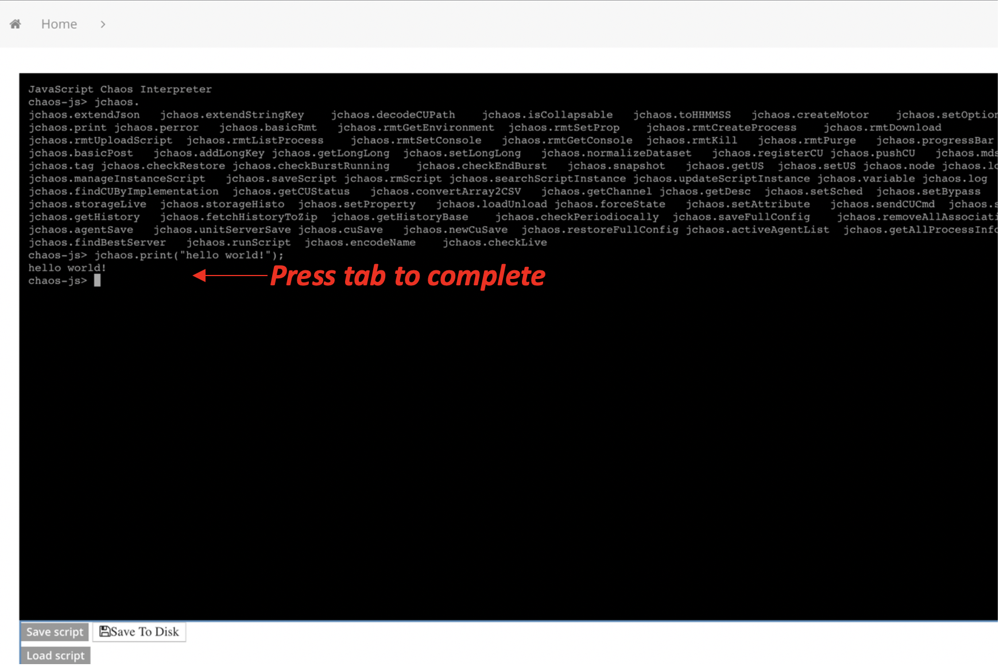

<table>
<thead>
<tr class="header">
<th>Andrea Michelotti Page 1 4/3/20</th>
<th></th>
</tr>
</thead>
<tbody>
<tr class="odd">
<td></td>
<td></td>
</tr>
</tbody>
</table>

Table of Contents
=================

[Getting Started 3](#getting-started)

[CU View 4](#cu-view)

[CU Context Menu 6](#cu-context-menu)

[Show/Set/Plot 8](#showsetplot)

[Tagging 12](#tagging)

[Show Tag Info 13](#show-tag-info)

[Retrive Zip History 14](#retrieve-zip-history)

[Show description 15](#show-description)

[Take Snapshot 16](#take-snapshot)

[Management View 18](#management-view)

[Create an US 19](#create-an-us)

[Adding CU 20](#adding-cu)

[Copy/Move CU 21](#copymove-cu)

[US lifecycle 22](#us-lifecycle)

[US associated to agent 22](#us-associated-to-agent)

[US manually launched 23](#us-manually-launched)

[Associate a US to an Agent 23](#associate-a-us-to-an-agent)

[Process View 25](#process-view)

[ChaosShell View 26](#chaosshell-view)

[Configuration View 27](#configuration-view)

[Dashboard Variables 27](#dashboard-variables)

[Dashboard Settings 28](#dashboard-settings)

[Configuration 28](#configuration)

[About 29](#about)

[Video Tutorials 30](#video-tutorials)

[Dashboard settings 30](#dashboard-settings-1)

Getting Started
===============

A web !CHAOS dashboard is associated to an installation of !CHAOS, at
the moment there are two installations:

1 – preproduction, used mainly for testing of things that are going to
production <http://chaost-hawebui.lnf.infn.it/>

2 – production used in production <http://chaos-hawebui.lnf.infn.it/>

i

CU View
=======

From this view its’ possible to monitor and control CUs in a generic
way. The dashboard shows by default this view. On start the view is
empty, the user has to make its own selection through the *Zone*,
*Group* or *Custom search*. The information of the CU is given in a
table view. The columns are self-explanatory.

In the bottom of the CU view a generic control of the selected CU is
shown (Figure 2 Monitor & Control).

Figure 1 Dashboard (CU view)

The CU view has two parts:

1.  Monitor table

2.  Generic control panel

In the monitor table the selected CUs show their state, uptime, alarms,
bandwidth.

In the control panel it’s possible to give commands to one or more CU
that are selected (highlighted in yellow).

**NOTE**: The ***Available commands*** is dynamically reconfigured in
base to the last CU selected.

Figure 2 Monitor & Control

CU Context Menu
---------------

In addition to the explicit generic control panel, a **context menu** is
available once a CU is selected (yellow) shown in Figure 3 CU context
menu. In order to access to the context menu, you should select a CU by
clicking the mouse and then push the right button of the mouse.

Figure 3 CU context menu

The context menu allows easily to change status of one or more CUs (the
same operation can be done by the generic control panel), here below a
schema of the possible CU states and transitions:

Figure 4 CU states and transitions

The status of a CU is reported in the *Status* column of the table view.

A CU can be in different states:

-   NOT LOADED

-   LOADED

-   INITIALIZED

-   RUNNING

-   STOPPED

-   NOT INITIALIZED

The diagram shows the possible CU states (uppercase labels) and their
representative icons. The arrows indicate the commands

Without going into details, suffice to say that – in order to be fully
operational – a CU must stay in the RUNNING state.

When a US starts, it puts all its CUs in a predefined state, as from its
configuration data.

### Show/Set/Plot 

Through this item of the context menu is possible to visualize, set and
plot CU dataset items.

Figure 5 Setting an input attribute

##### Set Attribute

In the figure above is shown how to set the *speed* input attribute of
the selected CU.

Set attribute actions:

1.  Select CU, RIGHT CLICK

2.  Select *Show/Set/Plot*

3.  Open *input* dataset

4.  Go on *speed,* LEFT CLICK,

5.  Write in the textbox the desired value

6.  ENTER

**NOTE:** Just attributes belonging to *input* dataset can be set.

**  
**

##### Plot *attribute*

To plot an attribute, you should select it through the sequence of
actions of Set Attribute, but instead of LEFT CLICK on the attribute, do
RIGHT CLICK to open the plot menu.

Plot attribute actions:

1.  Select CU, RIGHT CLICK

2.  Select *Show/Set/Plot*

3.  Open *output* dataset

4.  Go on *speed,* RIGHT CLICK,

5.  On the plot menu select the plot type

ENTER

Figure 6 Plotting an attribute

In this example the attribute *position* (dataset *output*) is plotted
on Y (X will be the timestamp).

Once selected a graph option dialog will open.

Figure 7 Graph options

We are going to setup the graph options of our new graph, here you can
select the size of the graph, the type.

Continuing the setup we have to add the attribute that we want to plot,
the attribute that we have selected is ready to be inserted by clicking
on the **Add Trace.**

Figure 8 Trace add

**NOTE:** An attribute name is fully identified by the concatenation of
the CU path, dataset (i.e *input*, *ouput*) and the attribute name:
*&lt;ZONEPATH&gt;/&lt;GROUP&gt;/&lt;CUNAME&gt;/&lt;dataset
name&gt;/&lt;attribute name&gt;*

Figure 9 Trace add example

**NOTE:**
if the attribute is a vector it’s possible to select a particular
component by adding \[&lt;*index*&gt;\], if *index=-1 (\[-1\])* all
component are selected

To plot live or historical values, press **RUN.**

Saved graph can be recalled, from the *Graphs*

### Tagging

One or more CUs can be tagged for a given amount of time or for a number
of acquisition cycles. !CHAOS tagging feature allows the dataset to be
saved into a permanent storage and identified with a given **tag name**.

Data that are tagged can be retrieved easily specifying the name of the
tag, and the system guaranties that those data are not swapped out by
ageing operations.

Figure 10 Tag command

Actions:

1.  Select the CU to tag

2.  CLICK RIGHT and select **Tag for..**

3.  In the tag editor specify **tag name**

4.  Choose between TIME or CYCLE

5.  Specify a duration

6.  An optional description

7.  SAVE

The tagging operation starts once the SAVE has been pressed. *Figure*
*11 Tag editor*

In the *status* column will appear the icon of

Figure 12 Tagging in progress

### Show Tag Info

Through this option you can visualize information about the tags
associated to a particular CU.

Figure 13 Tag info dialog

### Retrieve Zip History

Through this function is possible to retrieve data corresponding to a
particular tag and or time interval, of a given CU. By selecting this
option from the context menu a query dialog will open.

Figure 14 Query Dialog

The main parameters to set up the query are the epoch timestamps (GMT),
that specify the interval of time we are interested of; *a time picker
widget* can be used to facilitate the setup of the correct interval. The
time picker has predefined time interval (Last 1h, Last 6h…) and the
possibility to define a custom interval range.

The user can specify a tag from a combo box or directly in the text
entry box. Some more technical parameters that can speed up the search
such as the page size and the chunk time in seconds. In particular if
the dataset is big it’s more convenient to reduce the chunk time and the
page size.

Once you’ve setup these parameters you can run the query (pressing RUN),
and the result will be displayed in a graph or returned as a JSON zip.

##### Retrieve ROOT Zip History

This is an experimental option that allows to download data in CERN ROOT
format, currently this option opens a Figure 14 Query Dialog, and
launches a !CHAOS process (see Process View ) that in background
retrieves the required data that can be accessed just after this process
ends.

### Show description

Through this option you can access to the full description of the
selected CU, it gives, for instance, the detail information of the
dataset, types, commands…

Figure 15 Description Dialog

### Take Snapshot

This function allows to save the setpoint of a selected group of CUs and
associate to this snapshot a name, in this way it can be recalled.

Figure 16 Take Snapshot dialog

A previously saved snapshot can be restored, through the menu always
present in the top right of the web page.

Figure 17 Access to the Snapshot Menu

The snapshot menu will show the snapshots associated to the selected CU
or all the snapshots if no CU is selected.

Figure 18 Snapshot Menu

The snapshot menu shows the CUs that belongs to a given snapshot.

From this dialog is possible to:

**Show:** the dataset that is going to be restored,

**Apply**: the snapshot

**Delete:** the snapshot

**Upload:** a previously saved snapshot or a manually set point

**Save:** the snapshot locally on disk

Management View
===============

From this view it’s possible to monitor, manage and control life cycle
of !CHAOS nodes.

All the operations can be performed just after having selected some
!CHAOS node, the two combo on top of the page allows to select the type
and the name of the !CHAOS node. The possible types are:

1.  **US** (Unit Server), that is the container of CUs (Control Units);

2.  **CU**(Control Unit), that is the node that abstract the control of
    some HW or virtual device;

3.  **Agent**, that is the CHAOS node that allows to launch US,
    ExecutionUnit processes associated with them;

4.  **Webui**, that is the !CHAOS node that provides REST services (i.e.
    for the dashboards)

5.  **CDS**, that are the !CHAOS nodes that provide !CHAOS node
    management, Live and History services

Once a type is selected (2) it’s possible to filter by name and by
activity (3) (just live nodes or all nodes), a list of nodes with some
other information should be displayed as a table.

By clicking RIGHT mouse on one or more node (4) it’s possible to access
to the **context menu** that will show the possible operation on the
selected node (5).

Common operations are typically **Start**, **Stop** or **Kill**.

Figure 19 Management View

In the following paragraphs will be described the most common
procedures.

Create an US
------------

Remind that an UnitServer is a container of Control Units/Execution
Units. Create an US means essentially a creation of a container and a
list of CUs that it manages.

To create an empty US we need just to RIGHT CLICK on the table and
choose **New US..**

Figure 20 New US

An **US Editor**, will be open,

Figure 21 US Editor

We need to provide an **unique** name that will identify the newly
created US. At this point we can just **save generating an empty US, or
we can upload an US configuration previously written on your local disk.
This is the preferred way when you want to import an US from one
infrastructure (i.e. test) to another (i.e. production).**

### Adding CU

To fill an empty US we can proceed in 3 ways:

1.  Add a CU from an existing local configuration

2.  Add a CU from a template

3.  Copy/Move an existing CU into the new US

For the first two we just have to select the new US and use the
**context menu**.

Figure 22 Add a CU from menu

The third method is strongly suggested if the device has similar
initializations, drivers. Through the use of the context menu you can
select a CU of the same type and use the a **copy/move** function.

### Copy/Move CU

To copy or move a CU to a specific US we should:

1.  Select **cu** in **Node Type**

2.  Select **Search All**

3.  Optional set the name or simply press **ENTER**

4.  Select the CU to move/copy

5.  RIGHT
    click -&gt; Copy CU

6.  Select **us** in **Node Type**

7.  Select the target US

8.  Paste/Move

9.  Choose if move or copy

After choosing the **CU Editor** will be open to modify name and
optionally any other parameter.

Figure 23 CU Editor

US lifecycle 
------------

We should distinguish between:

1.  US that are associated to a !CHAOS agent

2.  US that are not associated and are started manually.

In the first case, the life cycle and debug are simpler, because we can
handle full lifecycle from the dashboard through the agent (start, stop,
kill and console).

**NOTE**: the last column (*parent*) tells which is the agent node that
controls the US.

### US associated to agent

To start a US that is **not activ**e, we should:

1.  Select **us** in **Node Type**

2.  Select **Search All**

3.  Optional set the name or simply press **ENTER**

4.  Select the US

5.  RIGHT click -&gt; Start US..

Figure 24 Starting a US associated to Agent

Here in the figure above a we are going to start a US named
**FLAME\_TRL.**

To stop an US that is **activ**e, we should:

1.  Select **us** in **Node Type**

2.  Select **Search Alive**

3.  Optional set the name or simply press **ENTER**

4.  Select the US

5.  RIGHT click -&gt; Stop US.. or Kill Us.. or Shutdown

**NOTE:** Kill a US will kill all the CU the are contained as well

**NOTE:** Sometime the agent cannot kill in a ordered way the US, in
this case the **Shutdown** option must be selected, it performs a brute
force kill, that avoid also a clean response by the US, so the result of
the operations is often reported as *failed*, even if the kill operation
*succeed*.

**NOTE:** in rare cases (i.e. driver blocked in IO) even the
**shutdown** operation is not able to kill the process, in these cases
an intervention of the system administrator of the machine that runs the
US is required.

### US manually launched

In this case it’s not possible to fully control the lifecycle, the
dashboard can just try to stop the **US** performing a **shutdown**
operation.

**NOTE:** these US don’t have the *parent column* set.

### Associate a US to an Agent

The easiest way to create an association is:

1.  select the US to associate

2.  RIGHT click on the context menu and choose **Copy**.

Figure 25 Copying a US

1.  change **Node Type** to agent

2.  select the destination agent

3.  RIGHT click-&gt;Associate &lt;name of copied the US&gt;

Figure
26 Associate US

This point an **agent editor** will open, allowing to setup additional
parameters to the start of the associated US.

Figure 27 Agent Editor

Process View
============

This
view is mainly used to lunch, monitor and manage CHAOS processes. In the
top of the page are shown an array of graphs that monitor the load of
the available !CHAOS nodes that can host the execution of a new script,
process or application. In the process table are also shown the US that
are launched and managed by !CHAOS agents.

Figure 28 Process Table and its context menu

By RIGHT clicking in the blue area (in the red rectangle), you can
access the context menu for launching and managing script.

By selecting a process, you can access the context menu of the process.

ChaosShell View
===============

The chaos shell view offers the user the possibility to access !CHAOS
resources, through a web console, that accepts JavaScript. This web
console loads the *jchaos.js* library (the same used by the dashboard
itself), that allows to access !CHAOS resources.

The **CLI** (Command Line Interface) of this view offers the possibility
to quickly manage, control, test and debug a chaos infrastructure. From
this view is also possible load and execute file from you local disk.

Figure 29 Chaos shell view

**NOTE**: scripts may be also launched directly into infrastructure
through the Process View

The *chaos shell* embeds the *jchaos* module (project and documentation
on: [Jchaos.js library](https://baltig.infn.it/chaos-lnf-control/jchaos)
) that allows to access !CHAOS resources, a *completion* feature is
implemented to make easy to find jchaos APIs that start with the
*jchaos.* prefix (*namespace*).

**NOTE**: the jchaos.js module can be included both on WEB or nodejs
applications

Configuration View
==================

Through this view is possible to save and restore (**potentially
destructive**) the full configuration of a !CHAOS infrastructure. In the
table on the bottom of the page a list of the variables currently
defined.

Figure 30 Configuration View

The management, as any other feature of the dashboard, is available also
via CLI (command line interface) of the ChaosShell View.

Dashboard Variables
-------------------

The primary use of the variables is to store permanently *json objects*
that represent: configurations, states, meta data of not core *!CHAOS*
applications, like for instance the *dashboard*.

The dashboard uses:

1.  **tags** to store the information of the tags that are performed

2.  **cu\_templates** stores the information of cu templates (used when
    the user wants to create new CU from template)

3.  **highcharts** store the information about the configured graphs.

Dashboard Settings
==================

Configuration
-------------

Through *Settings-&gt;Config* you can set some useful parameters like
the default refresh rate of the !CHAOS nodes or the elements shown per
page.

By selecting *Config..* a editor will open showing the parameters that
can be edited.

NOTE: these values will be saved into the cache of the browser so these
parameters will be permanent until a clear cache is performed.

About
-----

Through *Setting-&gt;About..* you can access to the info of the most
important !CHAOS services: *mds, webui, agent*.

For instantce a system administrator through this panel can check the
build information of the different services.

Video Tutorials
=====================================================================================

Dashboard settings
------------------
